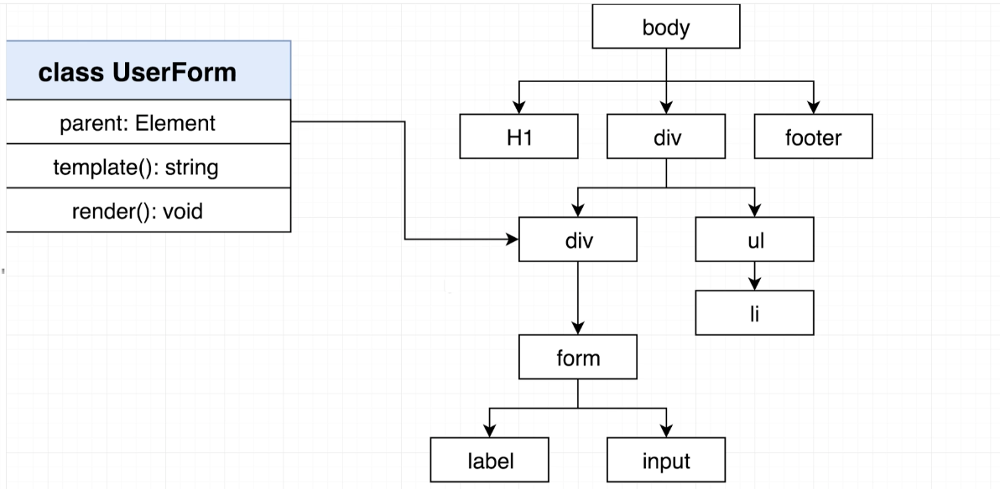
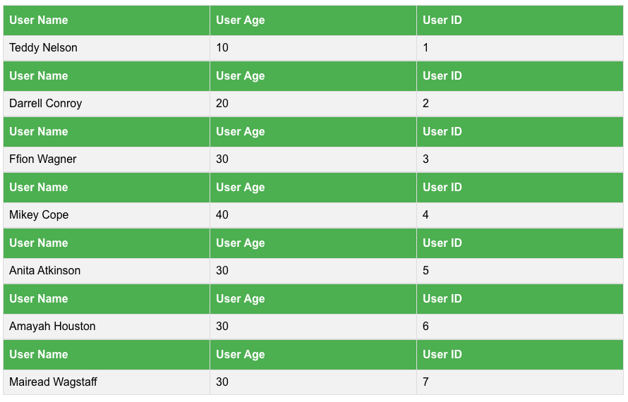
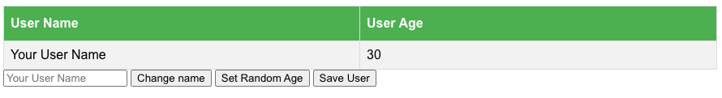

# Simple Web Framework

## Description
A simple, modular web framework modeled after [Backbone.js](https://backbonejs.org/) and [Marionette.js](https://marionettejs.com/) which provides the capability to add event handlers, render content and store it in a simple database.

Given an HTML template and parent element, it can search the DOM, append the content onto the parent and re-render the DOM.  

If event handlers are registered (such as 'change'), it can can auto render the DOM for every update to a particular field.



## To Start
`npm install`  
`npm install -g json-server`  
`npm run start`  

In your browser, navigate to [http://localhost:1234](http://localhost:1234)

## Sample Views
Inside of `src/index.ts` replace the contents with the following:

### List Of All Users

```
import { UserList } from './views/UserList';
import { Collection } from './models/Collection';
import { UserProps, User } from './models/User';

const users = new Collection('http://localhost:3000/users', (json: UserProps) => {
  return User.buildUser(json);
});

users.on('change', () => {
  const root = document.querySelector('#root');

  if (root) {
    new UserList(root, users).render();
  }
});

users.fetch();
```

### Edit the Name/Age of a User

```
import { UserEdit } from './views/UserEdit';
import { User } from './models/User';

const user = User.buildUser({ name: 'Your User Name', age: 30 });

const root = document.querySelector('#root');

if (root) {
  const userEdit = new UserEdit(root, user);

  userEdit.render();
} else {
  throw new Error('Root element not found');
}
```

### Special Thanks
> Credit to Stephen Grider's course: Typescript: The Complete Developer's Guide where the initial implementation was designed.
> https://www.udemy.com/course/typescript-the-complete-developers-guide/